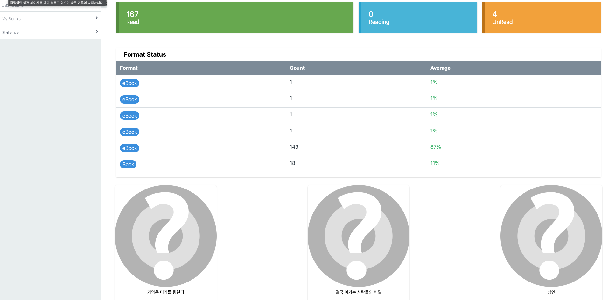

## 프로젝트 설명
독서한 내용 관리를 위한 프로젝트. ireaditnow 앱에서 필요하다 싶은 기능을 추가하여 개발  
React를 처음하기도 했고, 웹 형식 보단 모바일 형태로 개발하는 것이 좋을것 같아 백엔드는 그대로 활용하고 모바일 앱으로 바꿔서 개발 예정  

## 사용 기술
Bakcend : Django REST Framework  
Frontend: React

## 스크린샷
### 로그인

### 회원가입

### 대시보드
사용자가 등록한 책의 읽은 상태와 유형 및 최근에 읽은 책 목록을 나타냄
- 책 읽은 상태에 따른 건수
- 책 읽은 유형에 따른 건수
- 최근에 읽은 책 목록(3건)

### 책 리스트 조회
사용자가 등록한 책의 리스트를 조회

### 책 등록
사용자가 읽고자 하는 책을 등록.  
- 읽기 시작한 일자와 끝나는 일자 등록이 가능
- 책의 유형(종이책, 전자책 등) 선택이 가능함
- 외부 api(다음 책 api)를 통해 검색해서 등록이 가능

### 책 내용 상세
사용자가 등록한 책의 상세 내용 확인

### 노트 추가
사용자가 읽은 책에 독후감 형태의 노트 추가

### 책 검색
리스트화면에서 책 검색

### 사용자 정보 세팅
검색 api 변경 설정이 가능한 화면

